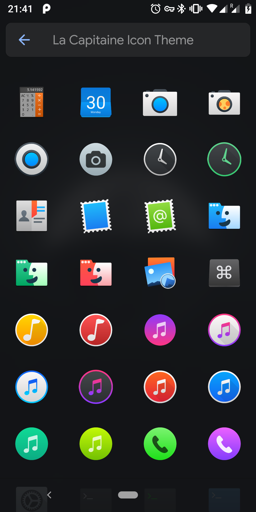
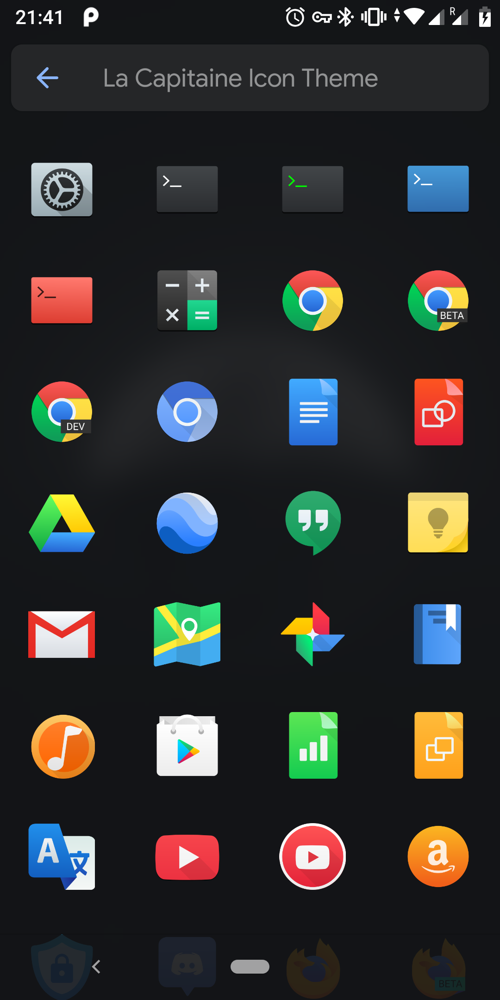
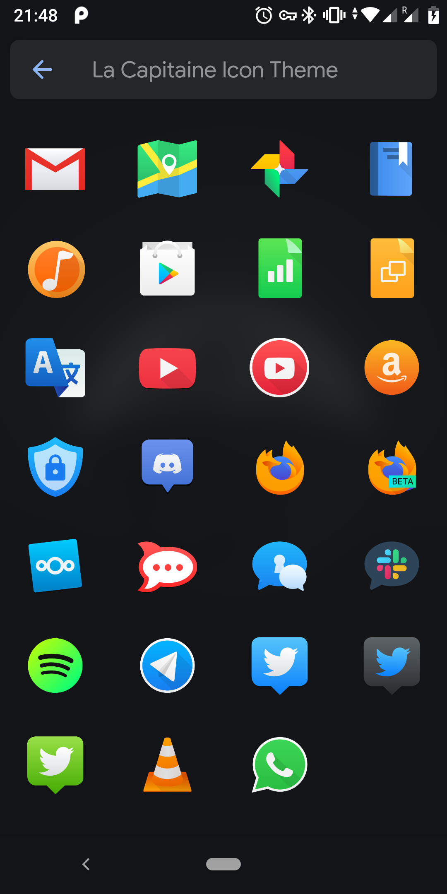

# La Capitaine Android

Icon pack for Android using the [La Capitaine](https://github.com/keeferrourke/la-capitaine-icon-theme)
icons.

  

It's only tested with Lawnchair (v10, v11), but is probably supported by a few
other launchers as well (the ones Lawnchair supports for icon packs).
Adding support for more launchers should be as simple as adding a few
`<intent-filter>`s to `AndroidManifest.xml`,
[see here](https://github.com/iamareebjamal/scratch_icon_pack_source/blob/master/app/src/main/AndroidManifest.xml).

Naturally I will add icons for the apps I'm personally using first as that's
the most straightforward way of making progress - I can directly test it on my
device. Most of the default AOSP and LineageOS apps, and a few popular Google
and messenger apps are already included as well.

Any help is highly appreciated!

## Requirements

- Android Studio
- Python 3.6+
- The following Python modules:
  [`CairoSVG`](https://pypi.org/project/CairoSVG/),
  [`colored`](https://pypi.org/project/colored/) and
  [`ruamel.yaml`](https://pypi.org/project/ruamel.yaml/)

  ```console
  pip3 install -r requirements.txt
  ```

## Installation

*There's no release of this app on the Google Play Store or F-Droid yet,
although that might happen in the future.*

Run `python3 res.py build` which will create the files `xml/appfilter.xml` and
`xml/drawable.xml` as well as rendering all used SVG icons (from
`la-capitaine-icon-theme/apps/scalable`) to PNG files.

Open the project in Android Studio, compile it and install it on your phone or
emulator.

Make sure to select `Launch: Nothing` in the run configuration as the app has
no launcher intent filter.

To remove the files created by the build script run `python3 res.py clean`.

## Development

To add missing icons, you'll need:

- The app package name
- The name of the activity that's missing an icon (usually the main activity)
- An icon from `la-capitaine-icon-theme/apps/scalable` that should be applied

Use a tool like [App Manager](https://f-droid.org/en/packages/io.github.muntashirakon.AppManager/)
to obtain these details (installable from F-Droid).

A new app entry in [`res.yml`](res.yml) looks like this:

```yaml
apps:
  - package: com.example.app
    activity: com.example.app.activities.MainActivity
    icon: example_icon
```

If `example_icon` doesn't exist yet, add it:

```yaml
icons:
  example_icon: example-icon.svg
```

This way an icon that's being used by multiple apps has only be included once
and general icons that don't belong to a specific app can be included as well.

Note that the activity domain doesn't necessarily match the package domain.
Please keep the entries sorted alphabetically by package name.

Now, do the steps from the *Installation* section again. You're done!

Try restarting your launcher application if new icons don't appear immediately.

## Authors

- **Linus Groh** ([**@linusg**](https://github.com/linusg/)) -
  Initial work on La Capitaine Android
- **Keefer Rourke** ([**@keeferrourke**](https://github.com/keeferrourke/)) -
  Creator of the La Capitaine Icon Theme

## License

This project is licensed under the GPLv3 license - see [`LICENSE`](LICENSE)
file for details.

